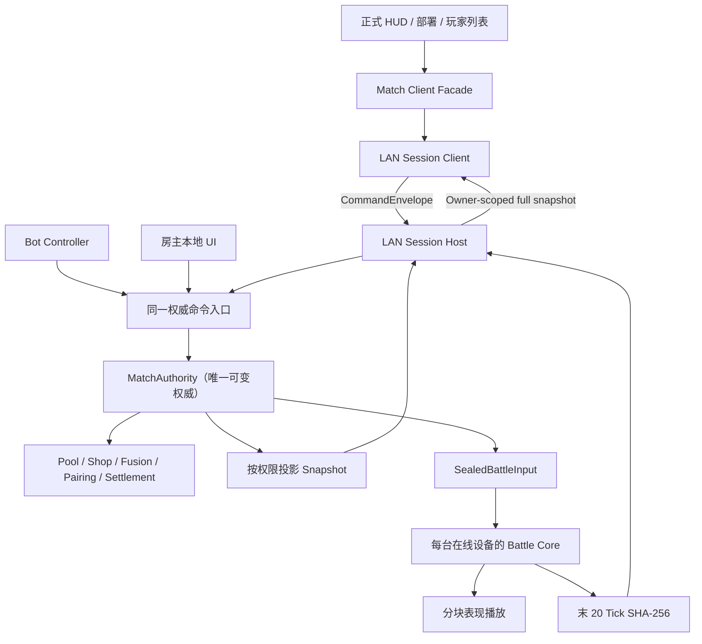

# 局域网同步对局实施计划

> 状态：M1–M3 已形成集成基线；M4 已在 `codex/lan-match-flow` 完成纯领域实现，M5—M8 尚未执行。
>
> 玩家可见规则见 [LAN-MATCH-DESIGN.md](LAN-MATCH-DESIGN.md)。战斗分块计算的独立 Agent 提示词见 [TASK-BATTLE-STREAMING.md](TASK-BATTLE-STREAMING.md)；M1 暴露出的既有 Battle 基线漂移由 [TASK-BATTLE-BASELINE-CLEANUP.md](TASK-BATTLE-BASELINE-CLEANUP.md) 单独处理。

实施 Agent 提示词：

| 里程碑 | 提示词 |
|---|---|
| M1 房主权威领域骨架 | [TASK-LAN-MATCH-DOMAIN.md](TASK-LAN-MATCH-DOMAIN.md) |
| M2 共享牌库、商店、经济与升级 | [TASK-LAN-MATCH-ECONOMY.md](TASK-LAN-MATCH-ECONOMY.md) |
| M3 自动合成与 Overflow | [TASK-LAN-MATCH-FUSION.md](TASK-LAN-MATCH-FUSION.md) |
| M4 配对、阶段、结算与淘汰 | [TASK-LAN-MATCH-FLOW.md](TASK-LAN-MATCH-FLOW.md) |
| M5 分层自动人机 | [TASK-LAN-MATCH-AI.md](TASK-LAN-MATCH-AI.md) |
| M6 LAN 会话、同步与重连 | [TASK-LAN-MATCH-SESSION.md](TASK-LAN-MATCH-SESSION.md) |
| M7 战斗分块与增量播放 | [TASK-BATTLE-STREAMING.md](TASK-BATTLE-STREAMING.md) |
| M8 正式运行时与端到端集成 | [TASK-LAN-MATCH-INTEGRATION.md](TASK-LAN-MATCH-INTEGRATION.md) |

## 1. 当前基线结论

当前代码已经具备可复用部分：

- UDP 房间发现；
- TCP 四字节大端长度前缀 + JSON 消息；
- 房间创建、加入、准备和开始；
- 每秒心跳与延迟显示；
- 纯 C# 的 `BattleRunner.Step()`；
- 本地 PlayerState、商店 UI、部署 UI、回合封存和多战斗演示。

但当前“开始游戏”不是联网对局：

1. `LanLobbyController.CompleteGameplayTransition()` 调用 `StopServices(false)`，主动关闭 `LanRoomHost/LanRoomClient`。
2. 关闭连接后只解除 `PreparationBattleLoopController` 的 Lobby Gate。
3. 每台设备随后各自加载固定 `local-match-state-v1`，独立运行本地四人 Demo。
4. `LocalMatchState` 只有本地玩家拥有真实 Gold、Level、Ready 命令所有权；它不是四席位房主权威状态。
5. 当前商店只保存 TypeId，使用每机本地 `System.Random`，购买时才拼接 `playerId-shop-序号` 生成 UnitId。
6. 当前断连路径总是从 `LobbyRoomState` 删除成员，无法在 Match 阶段保留席位。
7. 当前 Profile PlayerId 每次启动都用新 GUID，应用重开后无法作为稳定重连身份。
8. 当前 Lobby 消息上限 `4096` 字节、Snapshot 上限 `2048` 字节，不足以承载 Match 快照。

所以不能直接给现有 LobbySnapshot 添加几项字段；需要建立独立 Match 领域层，并把已有 TCP 从 Lobby 生命周期升级到 Match 生命周期。

## 2. 目标架构



依赖方向：

```text
Battle.Core
    ↑
Battle.Infrastructure
    ↑
PlayerState（可复用单位状态原语）
    ↑
Match（新建纯领域权威）
    ↑
Lobby/LAN Session（复用并升级现有连接）
    ↑
Assembly-CSharp 场景接线与 HUD
```

`Match` 不依赖 Socket、MonoBehaviour、场景或表现层。LAN 层不能包含经济、合成和配对规则。

## 3. 里程碑与顺序

### M0：文档与兼容清单

目标：

- 把已确认规则从 `LAN-MATCH-DESIGN.md` 对照合入 `SPEC.md`；
- 记录房主权威、无主机迁移、权限裁剪快照等长期决策；
- 定义 Match、Battle、单位目录和能力目录版本清单；
- 建立当前相关测试基线。

停止条件：

- 当前脏 `SPEC.md` 的修改来源无法判定；
- 单位或能力目录分支正在修改同一接口且没有可兼容的 manifest 边界。

### M1：Match 纯领域骨架

状态（2026-07-29）：

- 实现提交 `861f198` 与文档收口提交 `c615a75` 已快进集成到 `txym`；
- 已新增独立 `ARKnoNIGHTS.Match` 与 `ARKnoNIGHTS.Match.EditModeTests`；
- Match focused EditMode 为 `21/21`，LocalMatch、PreparationPhase、Lobby 回归分别为 `18/18`、`6/6`、`94/94`；
- 集成后在 `txym` 新目录重跑 Match focused EditMode，仍为 `21/21`，0 failed/skipped/inconclusive/not-run/not-runnable；
- 全量 EditMode 重跑为 `419/424`，全量 PlayMode 为 `70/72`；失败均位于既有 Battle 数据或测试期望，详见 [`history/TEST_RECORDS.md`](history/TEST_RECORDS.md)；
- 未执行 Windows/Android 构建、LAN 或场景人工流程；M2—M8 未实现。

M2 已具备领域基线，必须从包含 `c615a75` 的当前 `txym` 创建独立 worktree；不得从旧分支实现第二套权威状态。Battle 基线修复不属于 M2，按 [`TASK-BATTLE-BASELINE-CLEANUP.md`](TASK-BATTLE-BASELINE-CLEANUP.md) 独立处理。

建议新建：

```text
Assets/Game/Runtime/Match/
  ARKnoNIGHTS.Match.asmdef
  Contracts/
  Authority/
  State/
  Economy/
  Pairing/
  Settlement/
  Fusion/
```

核心类型：

- `MatchAuthority`
- `MatchState`
- `MatchSeat`
- `MatchPhase`
- `MatchCommandEnvelope`
- `MatchCommandResult`
- `MatchCommandCode`
- `MatchSnapshotProjector`
- `PublicMatchSnapshot`
- `OwnerPrivateSnapshot`
- `HostMatchSnapshot`
- `MatchCompatibilityManifest`

要求：

- 固定四席位和开局冻结顺序；
- 单调 `StateRevision`；
- CommandId 幂等缓存；
- 单个权威事务只发布一次新 revision；
- 命令拒绝不改变状态；
- 不使用 `LocalPlayerId` 决定领域所有权；
- 每名玩家分别保存完整 Gold、Level、Ready、Shop、PlayerState；
- 公共、本人私有和房主状态分别投影；
- 所有集合稳定排序并可生成规范摘要。

验证：

- 纯 EditMode，不启动 Socket 或场景；
- 相同初始数据和命令序列得到相同摘要；
- 权限投影不泄漏其他玩家商店、赤金、Cost 和 HostOnly 字段；
- 重复 CommandId 不重复产生副作用。

M1 暴露出的 Battle 基线漂移必须按 [`TASK-BATTLE-BASELINE-CLEANUP.md`](TASK-BATTLE-BASELINE-CLEANUP.md) 作为独立任务处理，不能在 M1 或 M2 中顺手改测试期望：

- 真实对局动态果冻数量期望 `27`、实际 `24`；`SUMMON_JELLY_MINIONS` 的源、目录与 SPEC 没有对应规则变更，不能直接把期望改成 `24`，应先定位 Core 时间线回归；
- PlayMode 召唤隔离夹具预期动态 ID `-1..-3`、实际为空；该夹具的 `MaxTicks=101` 已不能覆盖攻击动画锁结束后的延迟施法，应修正夹具并保留三只召唤及规范负 ID 的语义期望；
- `5503` 精英 0 技能描述测试期望为空，但 authored 源和 BONDS 规范已明确为“每隔一段时间，分裂出三个<果冻丁>。”，应同步测试事实；
- 三项 `UnitSourceConsumerEditModeTests` 的常量 `359C...` 仍正确：当前检出文件含 `107` 个 CRLF，原始字节哈希为 `BE09...`，规范化为 LF 后仍精确得到 `359C...`。应让测试按规范换行计算哈希或用 `.gitattributes` 固定 LF，不得把常量改成机器相关的 `BE09...`。

修复必须重跑对应 focused 测试以及全量 EditMode/PlayMode；不得用批量替换当前实际值的方式消除断言。

### M2：共享牌库、商店、UnitId 与经济

状态（2026-07-30）：M2 基线提交为 `1d62ee713aa17ce24d2bc2098516d9c7eea55fed`，focused Match EditMode 为 `60/60`；M3 从该提交创建独立 worktree，未另建第二套权威状态。

在 M1 基础上串行实现：

- 根据实际运行时单位目录建立共享实体牌库；
- 开局为池内每张卡生成稳定、不复用的 UnitId；
- 稀有度池数量 `28/24/14/10/8/6`；
- 六格商店保存具体 UnitId；
- 冻结、返还、购买永久占用；
- 初始零刷新费用自然刷新；
- 主动刷新房主命令排序；
- 多玩家自然刷新“先归还、轮换起点、按槽交错抽取、原子发布”；
- 正式等级概率、刷新费用、升级费用；
- 初始 `7` 赤金、`16` Cost；
- 13 槽满时购买失败，即使潜在可合成；
- 第一回合最右自动购买与 `(5,2)` 尝试部署；
- 任意回合空阵时最右 Staging 单位安全部署。

技术约束：

- 使用 MatchSeed 驱动明确的确定性 PRNG，不使用每机各自推进的 `System.Random` 状态作为权威。
- Pool UnitId 可使用 `SessionId + PoolOrdinal` 的规范派生值；客户端把它当不透明字符串。
- 牌库外赠送明确不实现。
- 共享牌库剩余实体只存在于 HostOnly 状态。

### M3：合成和 Overflow

状态（2026-07-30）：已在 `codex/lan-match-fusion` 实现。当前 focused Match EditMode 为 `87/87`，包括 M1/M2 全部既有用例和 M3 自动合成、Buff、Cost、严格堆叠、Overflow、退休生命周期、投影与原子性用例；完整验证记录见 [`history/TEST_RECORDS.md`](history/TEST_RECORDS.md)。

在 M2 之后实现为一个原子“获得单位事务”：

1. 获得具体持久 UnitId；
2. 按当前阶段确定候选区域；
3. 自动同 TypeId、同 Elite 连锁合成；
4. 按 `Deployed > Staging > Overflow > UnitId` 选幸存实例；
5. 删除被消耗 ID；
6. 重映射指定单位 Buff 引用；
7. 必要时把超 Cost 的已部署幸存实例退到 Staging；
8. 按获取顺序提升 Overflow；
9. 发布一个新 StateRevision。

必须测试：

- ready/unready/battle 三种候选区；
- 不可合成和较低 maxElite；
- 连锁；
- 幸存 ID；
- Buff 引用；
- 部署 Cost 超限；
- Overflow 提升；
- 事务失败完全不改变状态。

### M4：配对、阶段、结算与淘汰

状态（2026-07-30）：已在 `codex/lan-match-flow` 实现。实现继续扩展唯一的 `MatchAuthority`，保持 `ARKnoNIGHTS.Match` 为 `noEngineReferences=true`、零程序集引用的纯 C# 领域层；未接入 AI、Socket、Battle Core adapter、场景或 UI。

实现：

- 30 秒准备阶段；
- 全部在线真人 ready 后立即封存；
- AI 无 ready；
- 掉线宽限玩家阻止提前开始但不阻止倒计时；
- 准备阶段掉线清 Ready；
- 四人六回合主客表；
- 4→3、3→2 切换避免可避免的连续对手；
- 三人官方 + 影子两场；
- 影子拥有者只接受官方结果；
- 战斗终局伤害比较；
- 基础收入、连续状态、R9+ 平局额外收入；
- 400 生命、负生命、同生命共享名次；
- 淘汰与旁观；
- 对局终止并直接回主界面。

Battle Core 只返回每场 Outcome 和双方生命伤害；M4 决定哪个玩家实际应用哪场结果。

### M5：自动人机

新建独立的 AI 层，引用 Match 的只读决策投影和命令契约：

- `BotObservation`
- `BotDecisionMachine`
- `BotOperationAdapter`
- `BotController`

要求：

- 只在准备阶段；
- 固定决策 Tick；
- 准备入口一次初始决策；
- Buy/Refresh/Upgrade/购买后立即 Deploy；
- 不 Freeze/Retreat/Relocate/SetReady；
- 全部真人 Ready 后不追加动作；
- 使用和真人完全相同的 MatchAuthority 命令；
- 接管和归还控制器不会重建玩家状态。

M5 可以在 M1/M2/M4 的公开接口稳定后独立 worktree 实现；不得直接修改场景或商店领域内部集合。

### M6：LAN 会话升级与重连

在 Match Contracts 稳定后改造现有 Lobby 连接：

#### 会话生命周期

```text
Discovering
→ Lobby
→ StartCommitted
→ Match
→ Ended
```

- `StartCommitted` 后停止房间发现，但不关闭 TCP listener 或已有 guest connection。
- `LanLobbyController` 隐藏大厅 UI并把 host/client 会话交给 Match Controller。
- Match 结束或房主退出才关闭会话。
- Match 阶段连接断开只解除 Connection，不删除 Seat。
- Lobby 阶段连接断开继续使用当前“删除成员并释放席位”规则。

#### 协议

保留四字节大端长度前缀，拆分 Lobby 与 Match envelope：

- Handshake / Compatibility
- MatchInitialized
- Command
- CommandAck
- ScopedSnapshot
- ClockSync
- BattleSeal
- FirstChunkReady
- FinalSecondHash
- ReconnectRequest / ReconnectAccepted / ReconnectRejected
- MatchEnded
- Ping / Pong

要求：

- 明确 schema/version；
- 有界消息大小；
- 严格 UTF-8；
- 未知 kind、缺字段、越权 playerId、非法 token、过大消息结构化拒绝；
- 不在日志记录 reconnect token；
- 同一连接串行写；
- 后台线程只收发和入队，MatchAuthority 在 Unity 主线程或单一 actor 中处理；
- 所有连接到达的命令由房主分配全局接受序号；
- 房主本地命令也经过同一权威队列。

#### 重连

- 首次 Match 初始化时为真人席位签发高熵 token；
- 本地持久化 `SessionId + HostEndpoint + PlayerId + Token + Compatibility`；
- Profile PlayerId 改为安装级持久身份，不再每次启动生成新 GUID；
- 重连重新检查版本清单和 token；
- 成功后发送当前权限裁剪完整快照、阶段时钟、当前 BattleSeal 和表现 Tick；
- 明确 Quit 清 token；
- Host 的 Match 已结束或 token 无效时清 token 并回主界面。

### M7：战斗分块计算

在独立 worktree 按 [TASK-BATTLE-STREAMING.md](TASK-BATTLE-STREAMING.md) 实施：

- 1800 Tick；
- 100 Tick 块；
- 首块后播放；
- 多战斗轮转计算；
- 检查点；
- 末 20 Tick SHA-256；
- 统一玩家生命伤害和 Outcome；
- 不实现 LAN 和 mismatch 处理。

M7 可与 M5、M6 并行，但必须使用独立 worktree；Unity 测试仍串行。

### M8：正式 UI 和回合接线

最后集成：

- `PreparationBattleLoopController` 不再自行加载固定四人 Match 并拥有权威时钟；
- HUD 从客户端权限裁剪快照投影；
- 房主本地也通过同一 Client Facade 观察 MatchAuthority；
- 部署、购买、刷新、冻结、升级、Ready、Quit 转换成 CommandEnvelope；
- 收到 Ack/Snapshot 后更新 UI，不做能覆盖房主状态的本地预测；
- Lobby Start 不再调用 `StopServices(false)`；
- 对局结束清理视图、会话、token 并返回主界面；
- 保留显式 Offline Fixture 入口供现有 UI 回归测试使用，不能让测试 fixture 暗中成为正式联网状态源。

优先使用运行时 Bootstrap 接线，避免不必要地修改场景和 Prefab。

## 4. Worktree 与冲突划分

| 任务 | 可并行 | 主要所有权 | 禁止触碰 |
|---|---|---|---|
| M1—M4 Match Domain | 否，按顺序 | 新 `Runtime/Match`、纯领域测试 | Lobby Socket、场景、Battle Presentation |
| M5 AI | M2/M4 接口稳定后可并行 | 新 `Runtime/Bots`、AI 测试 | Match 内部可变集合、场景 |
| M6 LAN Session | 可与 M5/M7 并行 | `Runtime/Lobby`、Match 网络测试 | Battle Core、经济实现、场景 |
| M7 Battle Streaming | 可与 M5/M6 并行 | Battle Core/Presentation/Demo | Lobby、Match Economy、AI |
| M8 Integration | 必须最后串行 | Initial controllers、HUD adapters | 未合并分支的同名文件 |

不要让多个 Agent 同时修改：

- `LanLobbyController.cs`
- `PreparationBattleLoopController.cs`
- `LocalMatchState.cs`
- `MultiBattlePresentationCoordinator.cs`
- 场景、Prefab 或其他 Unity 序列化资源

## 5. 测试金字塔

### 5.1 纯领域 EditMode

覆盖所有 Match 规则、命令原子性、权限投影、配对、经济、合成、AI 和确定性。绝大多数规则应在这里完成，不依赖 Socket 或场景。

### 5.2 协议和 loopback EditMode

- 编解码边界；
- 过大/畸形消息；
- 同一命令重发；
- revision 乱序；
- Lobby→Match 保持同一连接；
- Match 断线保席；
- token 重连；
- 主动 Quit；
- Host stop；
- 权限裁剪快照不会串发给错误连接。

### 5.3 PlayMode

- Lobby UI 开始后 TCP 仍存活；
- 正式 HUD 从 scoped snapshot 更新；
- 两个或更多进程内 loopback 客户端命令同步；
- 全部真人 Ready 提前开战；
- 掉线清 Ready、宽限、AI 接管和重连归还；
- BattleSeal、首块 ready、统一播放；
- 淘汰旁观权限；
- MatchEnded 返回主界面。

### 5.4 构建和实机

- Windows x64 构建；
- Android 构建；
- Windows + Android 同一 Wi-Fi：
  - 发现/加入/准备/开始；
  - 双方购买、刷新、部署同步；
  - 同一回合战斗；
  - 临时断网和重连；
  - 非房主退出 AI 接管；
  - 房主退出全局结束。

单机 EditMode、PlayMode 或同进程 loopback 不能替代最后的物理双设备验证。

## 6. 每个实施任务的完成门

- 先有非零测试数量的 Red/基线证据；
- 相关 EditMode 通过；
- 相关 PlayMode 通过；
- 全量 EditMode/PlayMode 无新增失败；
- `git diff --check` 通过；
- 无无关场景、Prefab、Package、ProjectSettings 修改；
- 未提交 `Library/Temp/Logs/Artifacts`；
- 提供 commit SHA、测试 XML/日志路径、未验证项和人工检查项；
- 主 Planner 审查并合并后才允许下一个高耦合里程碑开始。

## 7. 当前明确不实施

- 主机迁移；
- 牌库外赠送持久单位；
- 哈希不一致后的纠错；
- 反作弊；
- 结算界面和重赛；
- AI 高级策略；
- 未确认的冲家路线。
